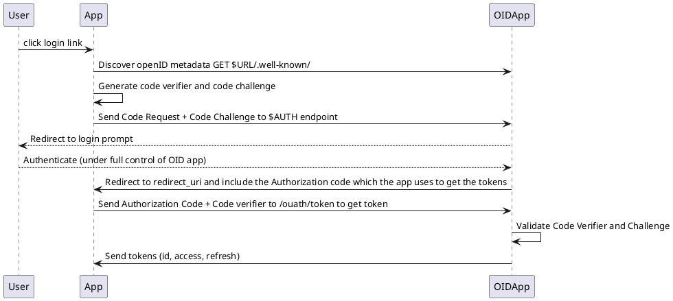

# Authentification

The Authentifications services are basically an own made openidconnect server that is standards
conformant when I need it to be but since I control client and server I am free to use newer
in development versions of OAuth that adds more security. I'll add as much compatibility as I need
for third party applications to use my server as basis if I need to but I might modify
those codebases aswell since I want my services to handle all federation and not the third party apps.

Some hosting of things like forgejo might get support though.

## Auth API
This is my understanding of how OpenID works and what it should do to authenticate A user.

The basis is OAuth2 with PKCE

Although I do want to enable some of the Extensions.
- JWT Tokens (not mandatory but common and imho prefered)
- Rich Authorization Requests. (RAR)
- Pushed Authorization Requests (PAR)
- JWT Authorization Requests (JAR)
- Proof of Possession (DPoP)

So two API flows are possible. One the traditional OAuth and then the Security improved one.

Additionally I want to implement a capability similar to Keycloaks ACR/Level of access. Which allows
applications to only request a simple login for parts of the application and 2fa or more
for parts requiring Admin access or simliar.

One more feature I will need for testing is impersonation to be able to test how an application 
works in the users context.

## Features to make it usefull outside of oxifed
To make identd usefull outside of oxifed some general features are going to be needed.

- Realms:
	Domains that act completely different from one another so that different apps can act completely
	differnt from eachother. All plugins are actived per Realm, all users and roles/groups are per realm
	all setings are per realm. Think Apache VHosts
- Declarative configuration:
	All realm config must only exist in a config file that is loaded into the server. I cannot be state
- Html input form builder:
  Make forms declarative (all html input elements have limited options) and provide a limited structure
	that we build for login.
- Themeing:
  Allow people to add custom CSS and Javascript to the forms. No HTML templateing
- Required Actions:
	Allow admins and users to force users to take certain actions before they can finish login or registration (verify mail, accept terms and conditions, register 2fa, webauthn)
- Passkeys:
	I want to support passkeys but due to recovery concerns I want to require a password even if it is only used for account recovery
- Custom profile properties:
	Things like SSH keys etc. are only needed in certain contexts.
- Profile to token mappers
	Small definitions which key from the profile ends up in under which key in the token. (JQ like selectors)
- Auth flow:
	Basicaly a array of required auth methofs for the realm/client
- Clients:
	Every app has it's own sub settings and auth (id, secret) secret is optional
